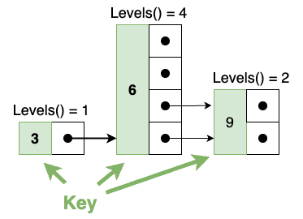
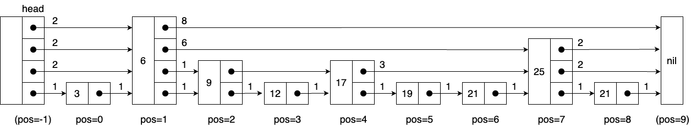

# Skip Lists in Go

[](https://github.com/andremueller/goskiplist/actions/workflows/go.yml)

## Introduction

This is a new skip list library programmed from scratch without any dependencies for Go supporting access by a key **and** index. Skip lists find a wider variety of application (e.g., sorted sets in the Redis database are implemented by skip lists according to their website <https://redis.com/glossary/redis-sorted-sets/>)

A skip list is an efficient, **probabilistic data structure** for storing and retrieving values by an orderable key where the operations of inserting, retrieving, and deleting elements have logarithmic cost in $n$ (the number of elements in the list) similar to search tree algorithms (e.g., red-black trees). The elements are all strictly ordered in a linked list and can therefore be easily iterated.

An element (=node) within a skip list is represented by a "tower" with randomly many levels (1... MaxLevels) such like this:

 

## Objectives

- Using Go generics for key and value.
- Simple maintainable code following as far as possible the original paper (1.)
- Allowing fast random access `SkipList.GetByPos()` of the nth element by combining the basic skip list algorithm in with the linear list operations (c.f. Ref 1. Section 3.4). The indexed access has an average runtime of $O(log(n))$. Currently, to my knowledge, I found no implementation of this. Furthermore, the linear access algorithm is described very briefly in the original paper.
- Flexible configuration of maximum level $L_{max}$ and probability $p$.

## Installation

```bash
go get github.com/andremueller/goskiplist/pkg/skiplist
```

## Usage Example

```go
// creates a skip list with key type `int` and value type `string`, sets max level to 10.
s := skiplist.NewSkipList[int, string](WithMaxLevel[int,string](10))

s.Set(1, "cat")
s.Set(2, "dog")

x, _ := s.Get(1)
fmt.Printf("Value: %s", x.Value)
// Output  "Value: cat"

x, _ = s.GetByPos(1)
fmt.Printf("Value: %s", x.Value)
// Output  "Value: dog"
```

## Background

In addition to the pointer vectors `Node.next` to the next elements, distances (i.e. how many points are skipped by the current pointer) are maintained by `Node.dist`. Distances are shown as small numbers above the pointer arrows in the following figure (example was enriched with distances from 1). Index positions are shown below the elements. The head element (entry into the skip list) has a position of -1, whereas the nil pointer at the end of the list has a position of $n$ (the number of elements in the list).



The `MaximumLevel` $L_{max}$ shall be chosen according to the expected maximum number of elements $n$ and the `Probability` p by (see Ref. 1)

$$L_{max} = \log_{1/p}(n)$$

Default values of $p$ is $0.5$ and $L_{max}=64$.

## References

1. W. Pugh, “A skip list cookbook” (Technical Report, University of Maryland at College Park, USA, 1990).

## MIT License

See [License](LICENSE).
